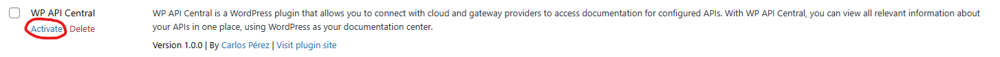

# wp-api-central

WP API Central is a WordPress plugin that allows you to connect with cloud and gateway providers to access documentation for configured APIs. With WP API Central, you can view all relevant information about your APIs in one place, using WordPress as your documentation center.

# Installation

To install WP API Central plugin you need to go to your plugins directory within Wordpress. Usually 'wp-content/plugins'.

Clone this repository.

`git clone https://github.com/mrcarlosdev/wp-api-central.git/`

After that, join the repository.

`cd wp-api-central/`

And move the folder content to the previous folder.

`mv wp-api-central/* .`

After doing so, you should be able to see the plugin deactivated in the Plugins section within Wordpress. https://yourwebsite/wp-admin/plugins.php.

Click on Activate to activate the plugin.
